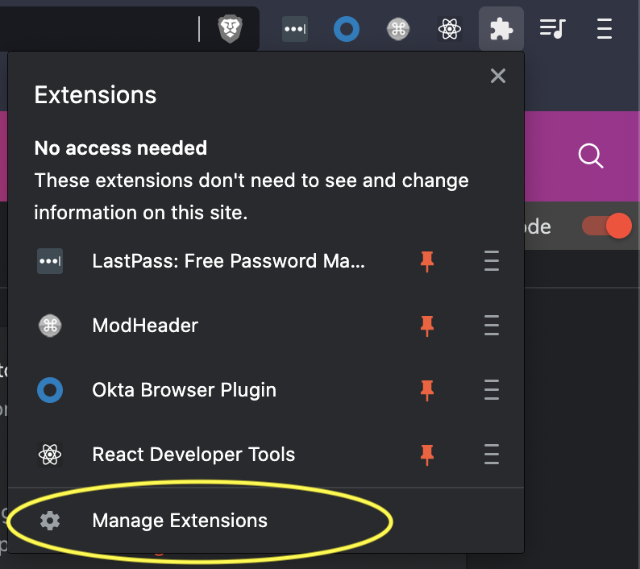
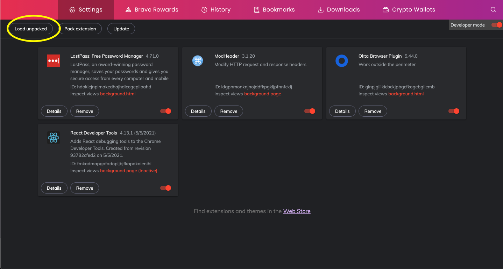
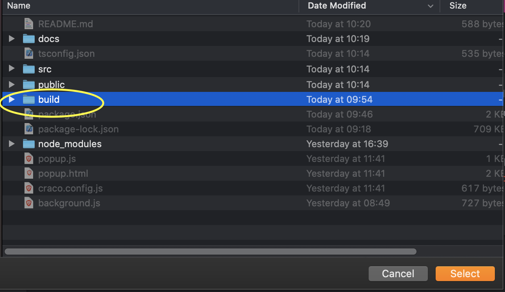
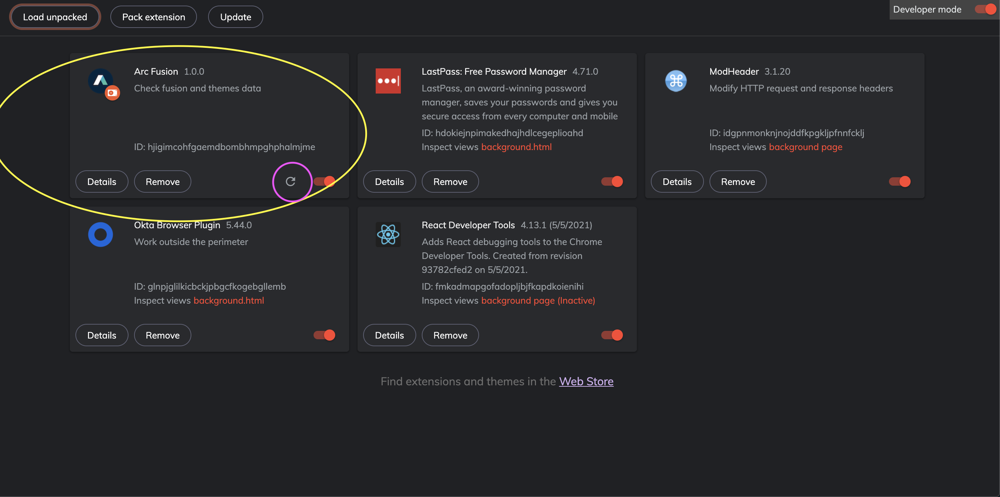
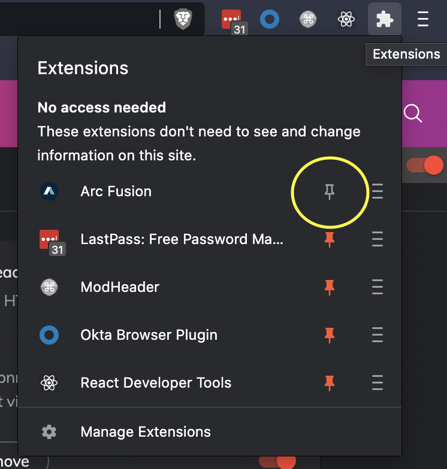
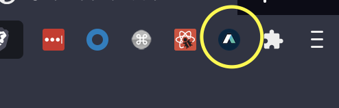
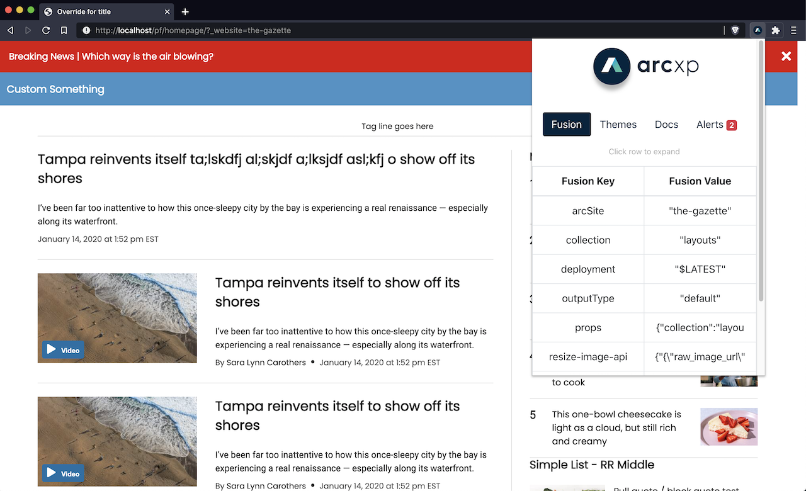

# Fusion Browser Extension

## How To Use
You'll need Fusion version `3.3.0` or higher to use it
## Go to Chrome Web Store 

## Load unpacked

1. In your Terminal, run `cd && git clone https://github.com/wapopartners/Fusion-Browser-Extension`
2. `cd Fusion-Browser-Extension && npm i && npm run build`
3. Go to your Chrome or Chromium-based browser (e.g., Brave) extension panel. Click the `Manage Extensions` button.
   
4. Ensure you have toggled on 'Developer mode'
   
5. Press button 'Load unpacked' button
   
6. Choose 'build' folder in the Fusion-Browser-Extension folder. (If you do not see the build folder here, please run `cd && cd Fusion-Browser-Extension && npm i && npm run build`. The build command creates the build folder.)
   
7. Now that the extension is loaded, you should see the icon in your extensions.
    NOTE: If you're a developer whose working on the extension, you can make a change then re-run `npm run build`. And, if you click the refresh button (circled in pink), you will see that change manifested.
8. To use the extension's user interface, the extension needs to be pinned to your top-menu.
    
9. Go to a page with fusion 2.8 with message posting. Click the extension to see content shared from fusion engine, including distribution tag and engine version, that was not previously accessible on the window.Fusion object. You can also see window.Fusion data like global content.
   

## Publish to Chrome Web Store

1. Login to your Google Workspace (your washpost email address) account through Okta
2. Go to Chrome Web Store and click gear and click Developer Console:
   Note: Only PB-Engine team members have access to the extension. If you don’t have access and don’t have other extensions, you may be prompted to “enroll” for the Chrome Web Store Developer program. Don’t enroll!
   
3. You will see the list of extensions
   
4. Click “Arc Fusion” extension.
5. Click “Package” from the left sidebar navigation. Then Click to “Upload new package” button.
   
6. Run `npm run build` to generate your static extension build
7. Select the `/build` directory and compress it to create a zip file.
8. Upload the new versioned zip package. Most of the package details will be defined in the manifest file within the zip package.
   Note: Make sure you are bumping up the version in every package we submit.
   
9. After the package is uploaded, save and submit for approval.

### References:

- [Update your Chrome Web Store item - Chrome Developers](https://developer.chrome.com/docs/webstore/update/)
- [Publish in the Chrome Web Store - Chrome Developers](https://developer.chrome.com/docs/webstore/publish/)
